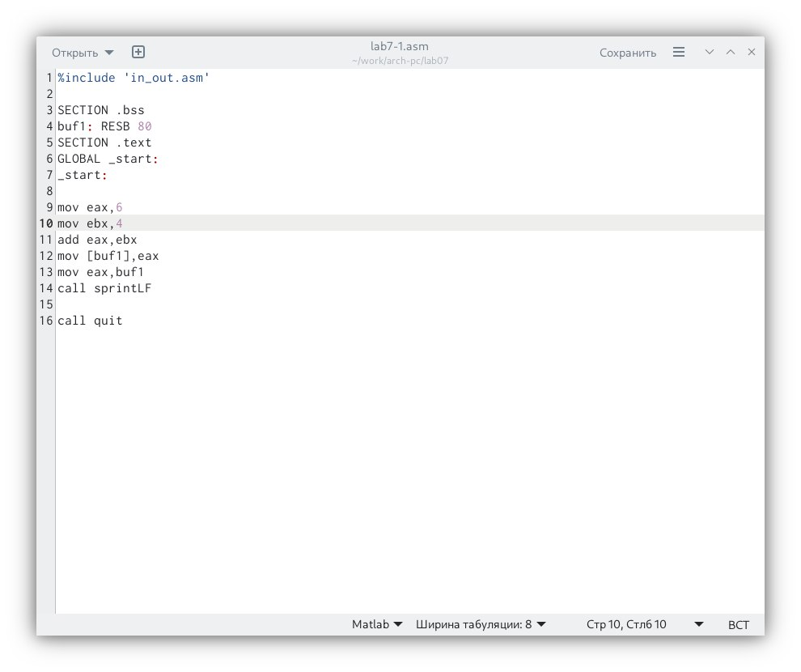
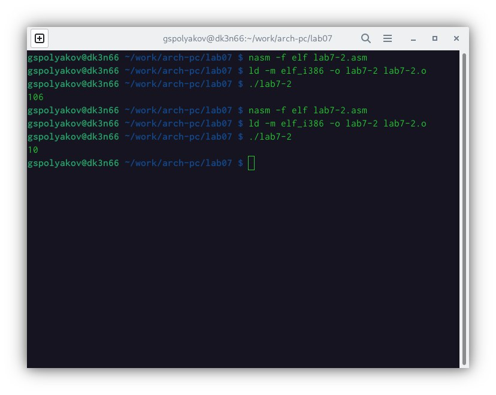
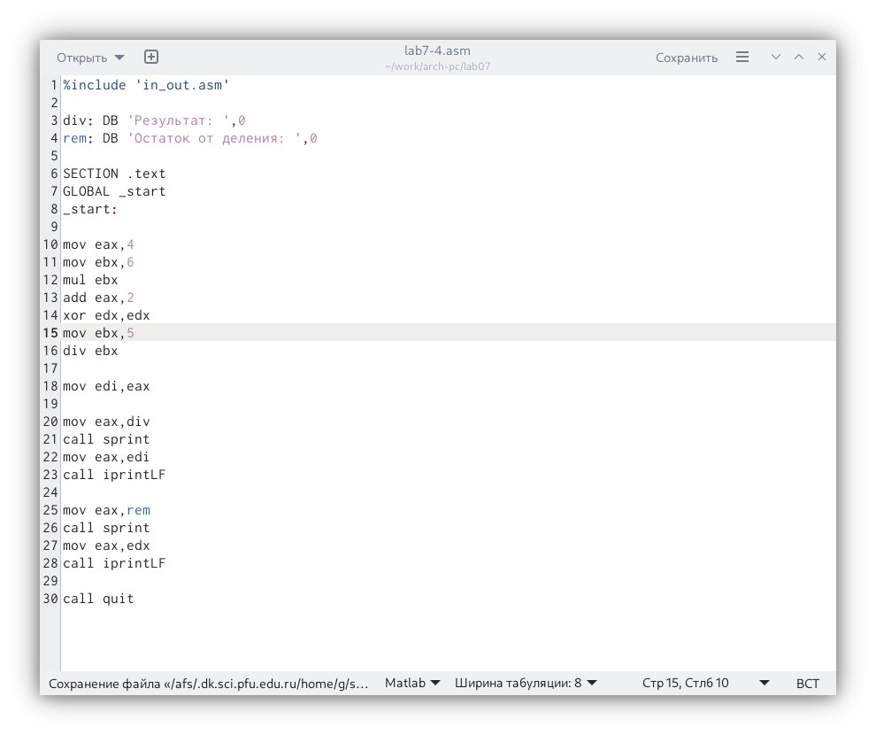
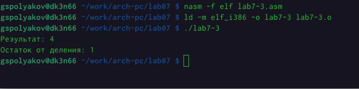
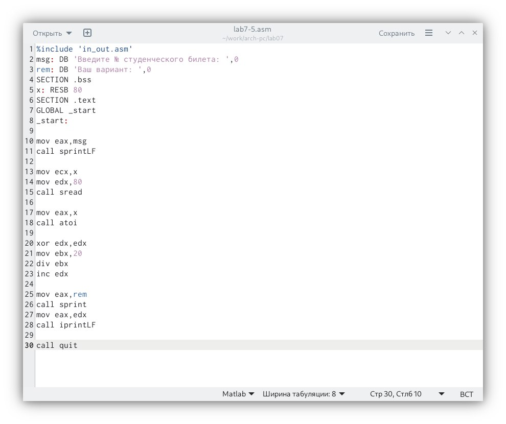
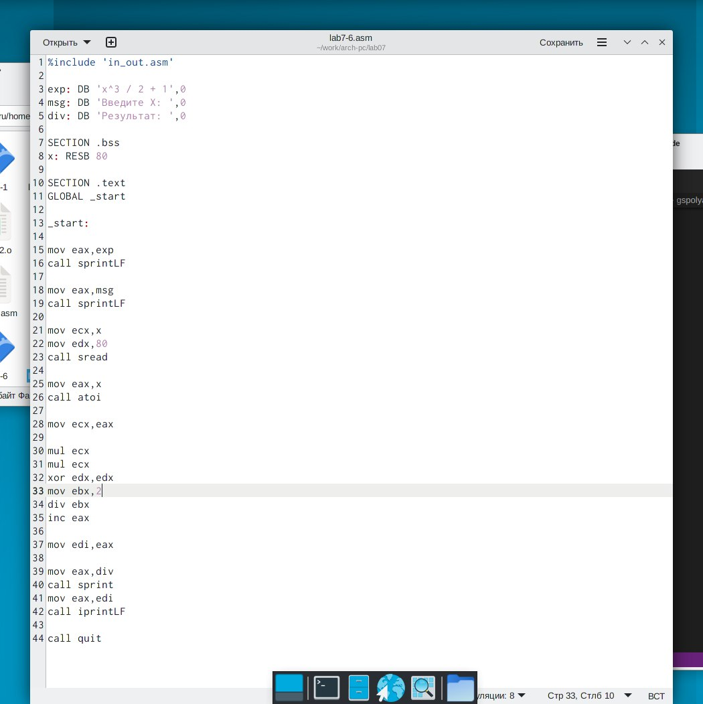
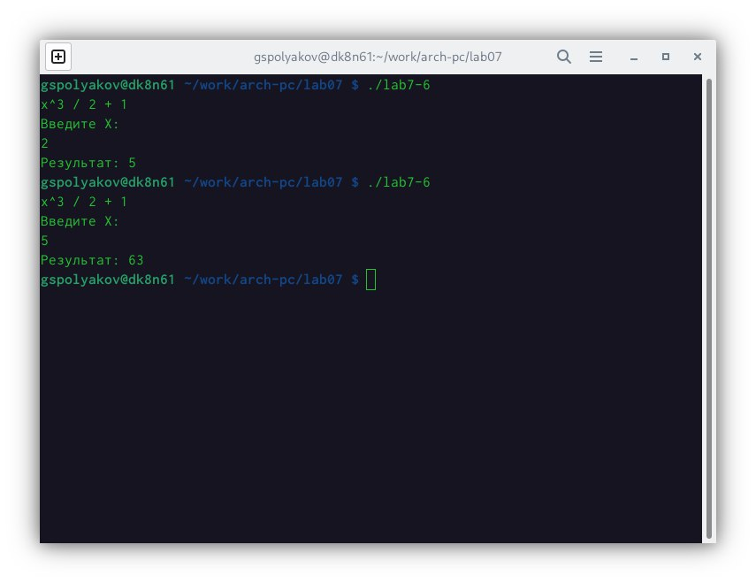

---
## Front matter
title: "Отчёт по лабораторной работе № 7"
subtitle: "Арифметические инструкции языка Ассемблер"
author: "Поляков Глеб Сергеевич"

## Generic otions
lang: ru-RU
toc-title: "Содержание"

## Bibliography
bibliography: bib/cite.bib
csl: pandoc/csl/gost-r-7-0-5-2008-numeric.csl

## Pdf output format
toc: true # Table of contents
toc-depth: 2
lof: true # List of figures
lot: true # List of tables
fontsize: 12pt
linestretch: 1.5
papersize: a4
documentclass: scrreprt
## I18n polyglossia
polyglossia-lang:
  name: russian
  options:
	- spelling=modern
	- babelshorthands=true
polyglossia-otherlangs:
  name: english
## I18n babel
babel-lang: russian
babel-otherlangs: english
## Fonts
mainfont: PT Serif
romanfont: PT Serif
sansfont: PT Sans
monofont: PT Mono
mainfontoptions: Ligatures=TeX
romanfontoptions: Ligatures=TeX
sansfontoptions: Ligatures=TeX,Scale=MatchLowercase
monofontoptions: Scale=MatchLowercase,Scale=0.9
## Biblatex
biblatex: true
biblio-style: "gost-numeric"
biblatexoptions:
  - parentracker=true
  - backend=biber
  - hyperref=auto
  - language=auto
  - autolang=other*
  - citestyle=gost-numeric
## Pandoc-crossref LaTeX customization
figureTitle: "Рис."
tableTitle: "Таблица"
listingTitle: "Листинг"
lofTitle: "Список иллюстраций"
lotTitle: "Список таблиц"
lolTitle: "Листинги"
## Misc options
indent: true
header-includes:
  - \usepackage{indentfirst}
  - \usepackage{float} # keep figures where there are in the text
  - \floatplacement{figure}{H} # keep figures where there are in the text
---

# Цель работы

Освоить арифметические инструкции языка Ассемблер

# Задание

### Символьные и численные данные в NASM

1. Создать каталог для программам лабораторной работы No 7, перейти в него и создать файл lab7-1.asm
2. Рассмотреть примеры программ вывода символьных и численных значений.
3. Далее изменить текст программы и вместо символов, записать в регистры числа. Исправьте текст программы (Листинг 1).
4. Как отмечалось выше, для работы с числами в файле in_out.asm реализованы подпрограммы для преобразования ASCII символов в числа и обратно. Преобразуйте текст программы из Листинга 7.1 с использованием этих функций.
5. Аналогично предыдущему примеру измените символы на числа.

###  Выполнение арифметических операций в NASM

1. В качестве примера выполнения арифметических операций в NASM приведите программу вычисления арифметического выражения 𝑓 (𝑥) = (5 ∗ 2 + 3)/3.
2. В качестве другого примера рассмотрим программу вычисления варианта задания по номеру студенческого билета, работающую по следующему алгоритму.
3. Ответить на вопросы.

# Теоретическое введение

## Адресация в NASM

Большинство инструкций на языке ассемблера требуют обработки операндов. Адрес операнда предоставляет место, где хранятся данные, подлежащие обработке. Это могут быть данные хранящиеся в регистре или в ячейке памяти. Далее рассмотрены все существующие способы задания адреса хранения операндов – способы адресации.
Существует три основных способа адресации:

* Регистровая адресация – операнды хранятся в регистрах и в команде используютсяименаэтихрегистров,например:mov ax,bx.
* Непосредственная адресация – значение операнда задается непосред- ственновкоманде,Например:mov ax,2.
* Адресация памяти – операнд задает адрес в памяти. В команде указывается символическое обозначение ячейки памяти, над содержимым которой требуется выполнить операцию.

Например,определимпеременную intg DD 3– это означает, что задается область памяти размером 4 байта, адрес которой обозначен меткой intg. В таком случае, команда

	mov eax,[intg] копирует из памяти по адресу intg данные в регистр eax. В свою очередь
	команда

	mov [intg],eax запишет в память по адресу intg данные из регистра eax. Также рассмотрим команду

	mov eax,intg В этом случае в регистр eax запишется адрес intg. 
Допустим, для intg выделена память начиная с ячейки с адресом 0x600144,тогда команда mov eax,intg аналогична команде mov eax,0x600144 – т.е. эта команда запишет в регистр eax число 0x600144.
##  Арифметические операции в NASM 
###  Целочисленное сложение add.
Схема команды целочисленного сложения add (от англ. addition - добавление) выполняет сложение двух операндов и записывает результат по адресу первого операнда. Команда add работает как с числами со знаком, так и без знака и выглядит следующим образом:

	add <операнд_1>, <операнд_2>

Допустимые сочетания операндов для команды add аналогичны сочетаниям операндов для команды mov.
Так, например, команда add eax,ebx прибавит значение из регистра eax к значению из регистра ebx и запишет результат в регистр eax.
Примеры:

	add ax,5; AX = AX + 5
	
	add dx,cx; DX = DX + CX
	
	add dx,cl; Ошибка: разный размер операндов.

###  Целочисленное вычитание sub.
Команда целочисленного вычитания sub (от англ. subtraction – вычитание)
работает аналогично команде add и выглядит следующим образом: 

	sub <операнд_1>, <операнд_2>

Так,например,командаsub ebx,5уменьшаетзначениерегистраebxна5и записывает результат в регистр ebx.
###  Команды инкремента и декремента.
Довольно часто при написании программ встречается операция прибавления или вычитания единицы. Прибавление единицы называется инкрементом, а вычитание — декрементом. Для этих операций существуют специальные ко- манды: inc (от англ. increment) и dec (от англ. decrement), которые увеличивают и уменьшают на 1 свой операнд.
Эти команды содержат один операнд и имеет следующий вид:

	inc <   > 
	
	dec <   >

Операндом может быть регистр или ячейка памяти любого размера. Команды инкремента и декремента выгодны тем, что они занимают меньше места, чем соответствующие команды сложения и вычитания.
Так, например, команда inc ebx увеличивает значение регистра ebx на 1,а команда inc ax уменьшает значение регистра ax на1. операнд операнд

###  Команда изменения знака операнда neg.
Еще одна команда, которую можно отнести к арифметическим командам это
команда изменения знака neg: 

	neg <операнд>

Команда neg рассматривает свой операнд как число со знаком и меняет знак операнда на противоположный. Операндом может быть регистр или ячейка памяти любого размера.

	mov  ax,1   ; AX = 1
	neg  ax     ; AX = -1

###  Команды умножения mul и imul.
Умножение и деление, в отличии от сложения и вычитания, для знаковых и беззнаковых чисел производиться по-разному, поэтому существуют различные команды.
Для беззнакового умножения используется команда mul (от англ. multiply – умножение):
mul <операнд>
Для знакового умножения используется команда imul:
imul <операнд>
Для команд умножения один из сомножителей указывается в команде и дол- жен находиться в регистре или в памяти, но не может быть непосредственным операндом. Второй сомножитель в команде явно не указывается и должен нахо- диться в регистре EAX,AX или AL, а результат помещается в регистры EDX:EAX, DX:AX или AX, в зависимости от размера операнда 7.1.

: Регистры используемые командами умножения в Nasm {#tbl:std-dir}

| Размер операнда | Неявный множитель | Результат умножения                                                                                                        |
|--------------|-----|---------------------------------------------------------------------------------|
| 1 байт       | AL  | AX                                                                              |
| 2 байта      | AX  | DX:AX                                                                           |
| 4 байта      | EAX | EDX:EAX                                                                         |

Таблица 7.1. Регистры используемые командами умножения в Nasm
Пример использования инструкции mul: 

	a dw 270
	
	mov ax, 100; AX = 100
	
	mul a; AX = AX*a,
	
	mul bl; AX = AL*BL
	
	mul ax; DX:AX = AX*AX

### Команды деления div и idiv.
Для деления, как и для умножения, существует 2 команды div (от англ. divide -
деление) и idiv: 
	
	div <делитель>; Беззнаковое деление
	idiv <делитель> ; Знаковое деление

В командах указывается только один операнд – делитель, который может быть регистром или ячейкой памяти, но не может быть непосредственным операндом. Местоположение делимого и результата для команд деления зависит от размера делителя. Кроме того, так как в результате деления получается два числа – частное и остаток, то эти числа помещаются в определённые регистры 7.2.

: Регистры используемые командами деления в Nasm {#7:2}

| Размер операнда (делителя) | Делимое | Частное | Остаток |
|--------------|---------|-------------|----------------------------------------------------------------|
| 1 байт       | AX      | AL   | AH                                                                    |
| 2 байта      | DX:AX   | AX   | DX                                                                    |  
| 4 байта      | EDX:EAX | EAX  | EDX                                                                   |

Например, после выполнения инструкций

	mov   ax,31
	mov   dl,15
	div   dl

результат 2 (31/15) будет записан в регистр al, а остаток 1 (остаток от деления 31/15) — в регистр ah.
Если делитель — это слово (16-бит), то делимое должно записываться в реги- страх dx:ax. Так в результате выполнения инструкций
  
	  mov   ax,2   ; загрузить в регистровую
	  mov   dx,1   ; пару `dx:ax` значение 10002h
	  mov   bx,10h
	  div   bx

в регистр ax запишется частное 1000h (результат деления 10002h на 10h), а в регистр dx — 2 (остаток от деления).

###  Перевод символа числа в десятичную символьную запись
Ввод информации с клавиатуры и вывод её на экран осуществляется в сим- вольном виде. Кодирование этой информации производится согласно кодовой таблице символов ASCII. ASCII – сокращение от American Standard Code for Information Interchange (Американский стандартный код для обмена информа- цией). Согласно стандарту ASCII каждый символ кодируется одним байтом.
Расширенная таблица ASCII состоит из двух частей. Первая (символы с кода- ми 0-127) является универсальной (см. Приложение.), а вторая (коды 128-255) предназначена для специальных символов и букв национальных алфавитов и на компьютерах разных типов может меняться.
Среди инструкций NASM нет такой, которая выводит числа (не в символьном виде). Поэтому, например, чтобы вывести число, надо предварительно преоб- разовать его цифры в ASCII-коды этих цифр и выводить на экран эти коды, а не само число. Если же выводить число на экран непосредственно, то экран воспримет его не как число, а как последовательность ASCII-символов – каждый байт числа будет воспринят как один ASCII-символ – и выведет на экран эти символы.
Аналогичная ситуация происходит и при вводе данных с клавиатуры. Вве- денные данные будут представлять собой символы, что сделает невозможным получение корректного результата при выполнении над ними арифметических операций.
Для решения этой проблемы необходимо проводить преобразование ASCII символов в числа и обратно.
Для выполнения лабораторных работ в файле in_out.asm реализованы под- программы для преобразования ASCII символов в числа и обратно. 
Это:

* iprint – вывод на экран чисел в формате ASCII, перед вызовом iprint в регистрeaxнеобходимозаписатьвыводимоечисло(mov eax,<int>).
* iprintLF – работает аналогично iprint, но при выводе на экран после числа добавляет к символ перевода строки.
* atoi – функция преобразует ascii-код символа в целое число и записает результат в регистр eax, перед вызовом atoi в регистр eax необходимо записатьчисло(mov eax,<int>).

# Выполнение лабораторной работы

1. Создал каталог lab07 и создал файл lab7-1.asm (Рис. 1).

2. Написал программу по листингу 7.1 (Рис. 1).

3. Изменил текст программы, выходной символ не отображается.

{ #fig:001 width=70% }

4. Создал файл 7-2.asm и ввел программу (Рис. 2)
5. 
.jpeg){ #fig:002 width=70% }

5. Заменил текст программы. Получен результат 10.

{ #fig:003 width=70% }

6. Создал файл, ввел текст программы 7-4. Получил результат (Рис. 3) (Рис. 4)

{ #fig:004 width=70% }

{ #fig:005 width=70% }

7. Создал файл и ввел текст программы 7-5. Получил результат 6.

{ #fig:006 width=70% }

.jpeg){ #fig:007 width=70% } 

## Выполнение задания для самостоятельной работы.

Ввел текст программы 7-6 варианта 6.

Получил результат.
{ #fig:005 width=70% } 
{ #fig:005 width=70% } 

# Выводы

Выполняя лабораторную работу №7, я научился использовать арифметические операции Ассемблера.

# Список литературы{.unnumbered}

::: {#refs}
:::
