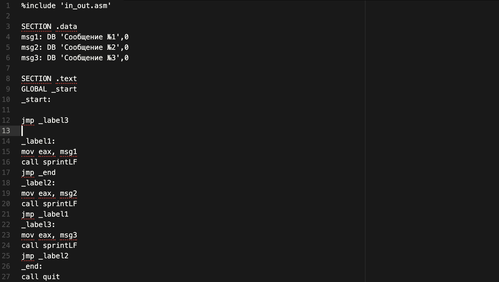
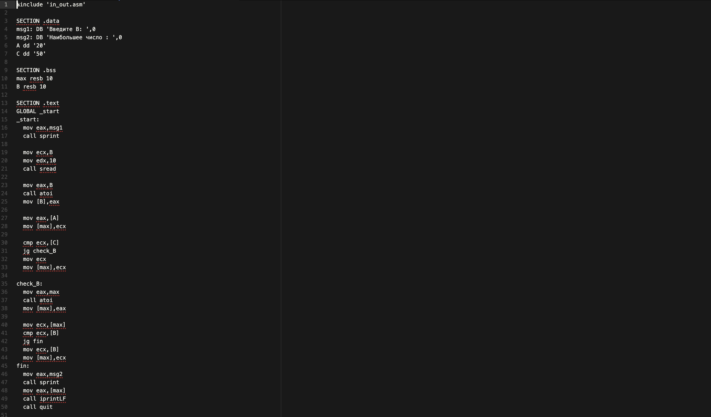
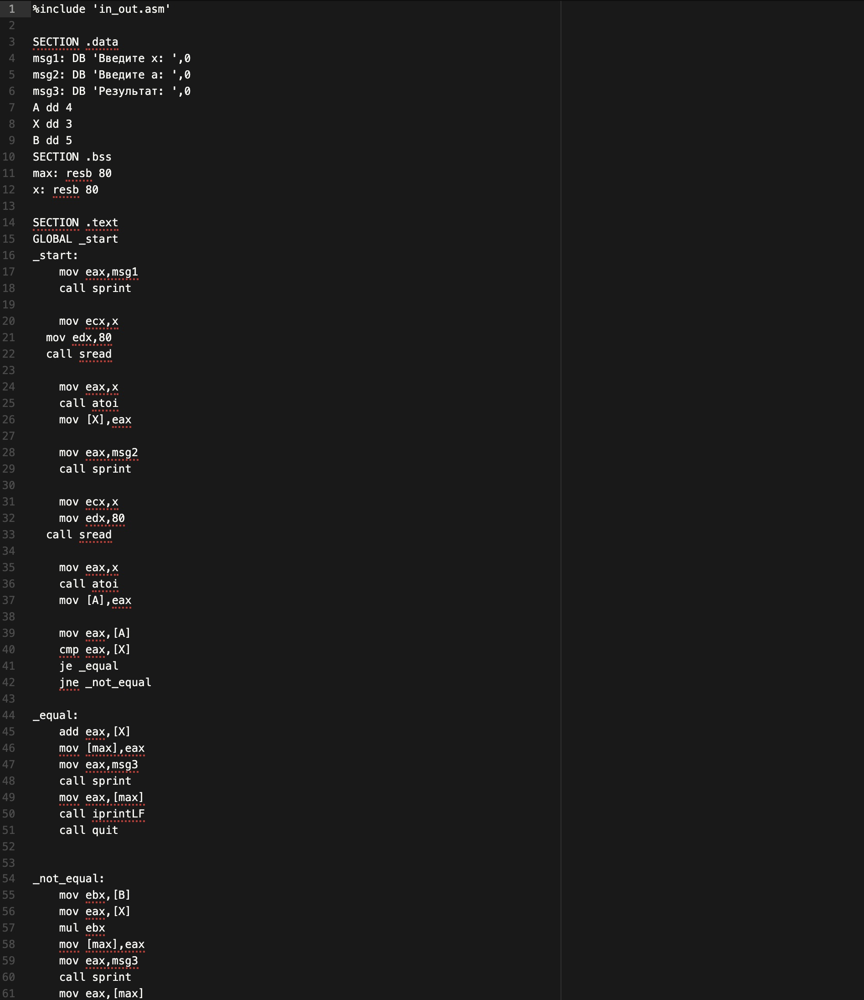
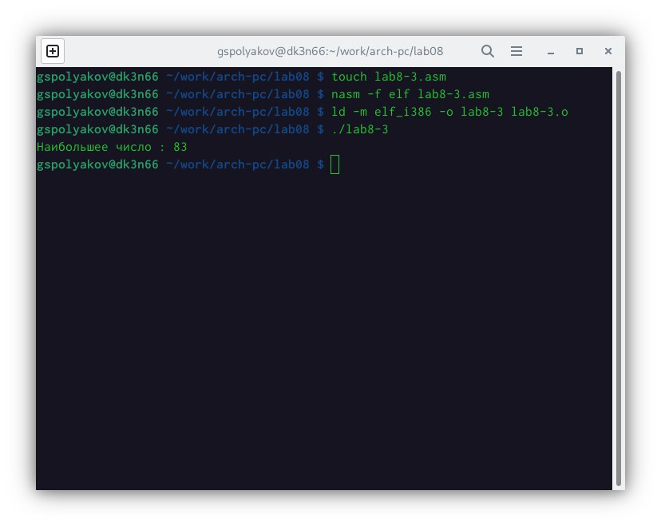
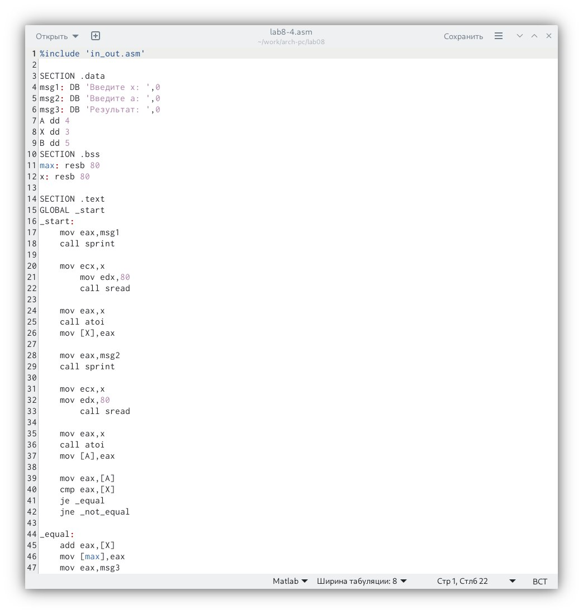

---
## Front matter
title: "Отчёт по лабораторной работе № 8"
subtitle: "Команды безусловного и условного переходов в Nasm. Программирование ветвлений."
author: "Поляков Глеб Сергеевич"

## Generic otions
lang: ru-RU
toc-title: "Содержание"

## Bibliography
bibliography: bib/cite.bib
csl: pandoc/csl/gost-r-7-0-5-2008-numeric.csl

## Pdf output format
toc: true # Table of contents
toc-depth: 2
lof: true # List of figures
lot: true # List of tables
fontsize: 12pt
linestretch: 1.5
papersize: a4
documentclass: scrreprt
## I18n polyglossia
polyglossia-lang:
  name: russian
  options:
	- spelling=modern
	- babelshorthands=true
polyglossia-otherlangs:
  name: english
## I18n babel
babel-lang: russian
babel-otherlangs: english
## Fonts
mainfont: PT Serif
romanfont: PT Serif
sansfont: PT Sans
monofont: PT Mono
mainfontoptions: Ligatures=TeX
romanfontoptions: Ligatures=TeX
sansfontoptions: Ligatures=TeX,Scale=MatchLowercase
monofontoptions: Scale=MatchLowercase,Scale=0.9
## Biblatex
biblatex: true
biblio-style: "gost-numeric"
biblatexoptions:
  - parentracker=true
  - backend=biber
  - hyperref=auto
  - language=auto
  - autolang=other*
  - citestyle=gost-numeric
## Pandoc-crossref LaTeX customization
figureTitle: "Рис."
tableTitle: "Таблица"
listingTitle: "Листинг"
lofTitle: "Список иллюстраций"
lotTitle: "Список таблиц"
lolTitle: "Листинги"
## Misc options
indent: true
header-includes:
  - \usepackage{indentfirst}
  - \usepackage{float} # keep figures where there are in the text
  - \floatplacement{figure}{H} # keep figures where there are in the text
---

# Цель работы

Изучение команд условного и безусловного переходов. Приобретение навыков написания программ с использованием переходов. Знакомство с назначением и структурой файла листинга.

# Задание

1. Создайте каталог для программам лабораторной работы No 8, перейдите в него и создайте файл lab8-1.asm
2. Введите в файл lab8-1.asm текст программы из листинга 8.1.
3. Создайте файл lab8-2.asm в каталоге ~/work/arch-pc/lab08. Внимательно изучите текст программы из листинга 8.3 и введите в lab8-2.asm.
4.  Создайте файл листинга для программы из файла lab8-2.asm. Внимательно ознакомиться с его форматом и содержимым. Подробно объяснить содержимое трёх строк файла листинга по выбору.

## Задание для самостоятельной работы
1. Напишите программу нахождения наименьшей из 3 целочисленных переменных a, b и c. Значения переменных выбрать из табл. 8.5 в соответствии с вариантом, полученным при выполнении лабораторной работы No 7. Создайте исполняемый файл и проверьте его работу.
2. Напишите программу, которая для введенных с клавиатуры значений x и a вычисляет значение заданной функции f(x) и выводит результат вычислений. Вид функции f(x) выбрать из таблицы 8.6 вариантов заданий в соответствии с вариантом, полученным при выполнении лабораторной работы No 7. Создайте исполняемый файл и проверьте его работу для значений x и a из 8.6.

# Теоретическое введение

## 8.2. Теоретическое введение

Для реализации ветвлений в ассемблере используются так называемые команды передачи управления или команды перехода. Можно выделить 2 типа переходов:

* условный переход – выполнение или не выполнение перехода в определенную точку программы в зависимости от проверки условия.

* безусловный переход – выполнение передачи управления в определенную точку программы без каких-либо условий.

### 8.2.1. Команды безусловного перехода

Безусловный переход выполняется инструкцией jmp (от англ. jump – прыжок), которая включает в себя адрес перехода, куда следует передать управление:

	jmp  <адрес_перехода>

Адрес перехода может быть либо меткой, либо адресом области памяти, в которую предварительно помещен указатель перехода. Кроме того, в качестве операнда можно использовать имя регистра, в таком случае переход будет осуществляться по адресу, хранящемуся в этом регистре (см. табл. 8.1).

Таблица 8.1. Типы операндов инструкции jmp

| Тип операнда | Описание|
|--------------|-----------------------------------------------------|
| jmp label    | переход на метку label                              |
| jmp [label]  | переход по адресу в памяти, помеченному меткой label|
| jmp eax      | переход по адресу из регистра eax                   |

В следующем примере рассмотрим использование инструкции jmp:

	label:
		... ;
		... ; команды
		... ;
		jmp  label

### 8.2.2. Команды условного перехода

Как отмечалось выше, для условного перехода необходима проверка какого-либо условия. В ассемблере команды условного перехода вычисляют условие перехода анализируя флаги из регистра флагов.

**8.2.2.1. Регистр флагов**

Флаг – это бит, принимающий значение 1 («флаг установлен»), если выполнено некоторое условие, и значение 0 («флаг сброшен») в противном случае. Флаги работают независимо друг от друга, и лишь для удобства они помещены в единый регистр — регистр флагов, отражающий текущее состояние процессора. В следующей таблице указано положение битовых флагов в регистре флагов.
Флаги состояния (биты 0, 2, 4, 6, 7 и 11) отражают результат выполнения арифметических инструкций, таких как ADD, SUB, MUL, DIV.

## Таблица 8.2. Регистр флагов

| Бит | Обозначение |  Название | Описание |
|-----|-------------|-----------|-------------------------------------------------------------------|
| 0   | CF | Carry Flag - Флаг переноса | Устанавливается в 1, если при выполнении предыдущей операции произошёл перенос из старшего бита или если требуется заём (при вычитании). Иначе установлен в 0. |
| 2   | PF | Parity Flag - Флаг чётности | Устанавливается в 1, если младший байт результата предыдущей операции содержит чётное количество битов, равных 1. |
| 4   | AF | Auxiliary Carry Flag - Вспомогательный флаг переноса | Устанавливается в 1, если в результате предыдущей операции произошёл перенос (или заём) из третьего бита в четвёртый.|
| 6   | ZF | Zero Flag - Флаг нуля | Устанавливается 1, если результат предыдущей команды равен 0.|
| 7   | SF | Sign Flag - Флаг знака | Равен значению старшего значащего бита результата, который является знаковым битом в знаковой арифметике.|
| 11  | OF | Overflow Flag - Флаг переполнения | Устанавливается в 1, если целочисленный результат слишком длинный для размещения в целевом операнде (регистре или ячейке памяти).|

Более подробную информацию о регистре флагов см. [14; 15].

###  8.2.2.2. Описание инструкции cmp
Инструкция cmp является одной из инструкций, которая позволяет сравнить операнды и выставляет флаги в зависимости от результата сравнения. Инструкция cmp является командой сравнения двух операндов и имеет такой же формат, как и команда вычитания:

	cmp <операнд_1>, <операнд_2>

Команда cmp, так же как и команда вычитания, выполняет вычитание <операнд_2> - <операнд_1>, но результат вычитания никуда не записывается и единственным результатом команды сравнения является формирование флагов.

Примеры.

	cmp ax,'4'	; сравнение регистра ax с символом 4
	cmp ax,4 		; сравнение регистра ax со значением 4
	cmp al,cl; 	; сравнение регистров al и cl
	cmp [buf],ax 	; сравнение переменной buf с регистром ax

### 8.2.2.3. Описание команд условного перехода.
Команда условного перехода имеет вид

	  j<мнемоника перехода> label

Мнемоника перехода связана со значением анализируемых флагов или со способом формирования этих флагов.
В табл. 8.3. представлены команды условного перехода, которые обычно ставятся после команды сравнения cmp. В их мнемокодах указывается тот результат сравнения, при котором надо делать переход. Мнемоники, идентичные по своему действию, написаны в таблице через дробь (например, ja и jnbe). Программист выбирает, какую из них применить, чтобы получить более простой для понимания текст программы.

### Таблица 8.3.

| Типы операндов | Мнемокод | Критенрий условного перехода a \/ b | Значения флагов | Комментарий |
|-----------|---------|-----|------------------------------------------------|-------------------|
| Любые     | JE      | a=b | ZF=1           | Переход если равно            |
| Любые     | JNE     | a≠b | ZF=0           | Переход если не равно         |
| Со знаком | JL/JNGE | a<b | SF≠OF          | Переход если меньше           |
| Со знаком | JLE/JNG | a≤b | SF≠OF или ZF=1 | Переход если меньше или равно |
| Со знаком | JG/JNLE | a>b | SF=OFиZF=0     | Переход если больше           |
| Со знаком | JGE/JNL | a≥b | SF=OF          | Переход если больше или равно |
| Без знака | JB/JNAE | a<b | CF=1           | Переход если ниже             |
| Без знака | JBE/JNA | a≤b | CF=1илиZF=1    | Переход если ниже или равно   |
| Без знака | JA/JNBE | a>d | CF=0 и ZF=0    | Переход если выше             |
| Без знака | JAE/JNB | a≥d | CF=0           | Переход если выше или равно   |
 
Примечание: термины «выше» («a» от англ. «above») и «ниже» («b» от англ. «below») применимы для сравнения беззнаковых величин (адресов), а термины «больше» («g» от англ. «greater») и «меньше» («l» от англ. «lower») используются при учёте знака числа. Таким образом, мнемонику инструкции JA/JNBE можно расшифровать как «jump if above (переход если выше) / jump if not below equal (переход если не меньше или равно)».
Помимо перечисленных команд условного перехода существуют те, которые которые можно использовать после любых команд, меняющих значения флагов (табл. 8.4).

###Таблица 8.4. 
| Мнемокод | Значение флага для осуществления перехода | Мнемокод | Значение флага для осуществления перехода | 
|-----------|---------|-----|----------------|
| JZ        | ZF = 1  | JNZ   | ZF = 0         |
| JS        | SF = 1  | JNS | SF = 0         |
| JC        | CF = 1  | JNC | CF = 0         |
| JO        | OF = 1  | JNO | OF = 0         |
| JP        | PF = 1  | JNP | PF = 0         |

В качестве примера рассмотрим фрагмент программы, которая выполняет умножение переменных a и b и если произведение превосходит размер байта, передает управление на метку Error.

    mov   al, a
    mov   bl, b
    mul   bl
    jc    Error
    
## 8.2.3. Файл листинга и его структура
Листинг (в рамках понятийного аппарата NASM) — это один из выходных файлов, создаваемых транслятором. Он имеет текстовый вид и нужен при отладке программы, так как кроме строк самой программы он содержит дополнительную информацию.
Ниже приведён фрагмент файла листинга.

	10 00000000 B804000000
	11 00000005 BB01000000
	12 0000000A B9[00000000]
	13 0000000F BA0D000000
	14
	15 00000014 CD80
	
	mov eax,4
	mov ebx,1
	mov ecx,hello
	mov edx,helloLen
	int 80h

Строки в первой части листинга имеют следующую структуру (рис. 8.2).
Рис. 8.2. Структура листинга
Все ошибки и предупреждения, обнаруженные при ассемблировании, транслятор выводит на экран, и файл листинга не создаётся.
Итак, структура листинга:

* номер строки — это номер строки файла листинга (нужно помнить, что номер строки в файле листинга может не соответствовать номеру строки в файле с исходным текстом программы);

* адрес — это смещение машинного кода от начала текущего сегмента;

* машинный код представляет собой ассемблированную исходную строку в виде шестнадцатеричной последовательности. (например, инструкция int 80h начинается по смещению 00000020 в сегменте кода; далееидёт машинный код, в который ассемблируется инструкция, то есть инструкция int 80h ассемблируется в CD80 (в шестнадцатеричном представлении); CD80 — это инструкция на машинном языке, вызывающая прерывание ядра);

* исходный текст программы — это просто строка исходной программы вместе с комментариями (некоторые строки на языке ассемблера, например, строки, содержащие только комментарии, не генерируют никакого машинного кода, и поля «смещение» и «исходный текст программы» в таких строках отсутствуют, однако номер строки им присваивается).

# Выполнение лабораторной работы

1. Cоздал каталог и файл lab8-1.asm

2. Ввел текст программы в файл (рис. [-@fig:001])
{ #fig:001 width=70% }

3. Создал файл lab8-2.asm, ввел текст программы (рис. [-@fig:002])
{ #fig:002 width=70% }

4. 12 00000005 BB01000000        mov ebx,1
   13 0000000A B9[00000000]      mov ecx,hello
   14 0000000F BA0E000000        mov edx,helloLen
   
   12 – Помещение значения BB01000000 в операнд 00000005
   13 – Помещение значения B9[00000000] в операнд 0000000A
   14 – Помещение значения BA0E000000 в операнд 0000000F

##  Выполнение

1.  Написал программу нахождения наименьшей из 3 целочисленных переменных a, b и с (рис. [-@fig:003]). Значения переменных выбрал из табл. 8.5 в соответствии с вариантом, полученным при выполнении лабораторной работы No 7. Создал исполняемый файл и проверил его работу. (рис. [-@fig:004])

{ #fig:003 width=70% }

{ #fig:004 width=70% }

2. Напишите программу, которая для введенных с клавиатуры значений x и a вычисляет значение заданной функции f(x) и выводит результат вычислений (рис. [-@fig:005]). Вид функции f (x) выбрать из таблицы 8.6 вариантов заданий в соответствии с вариантом, полученным при выполнении лабораторной работы No 7. Создайте исполняемый файл и проверьте его работу для значений x и a из 8.6.(рис. [-@fig:006])

{ #fig:005 width=70% }

.jpeg){ #fig:006 width=70% }

# Выводы

Выполняя лабораторную работу, я изучил команды условного и безусловного переходов. Приобрел навыки написания программ с использованием переходов. Познакомился с назначением и структурой файла листинга.

# Список литературы{.unnumbered}

::: {#refs}
:::
