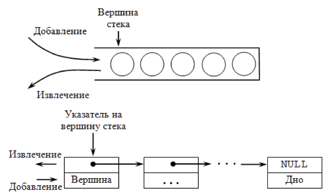
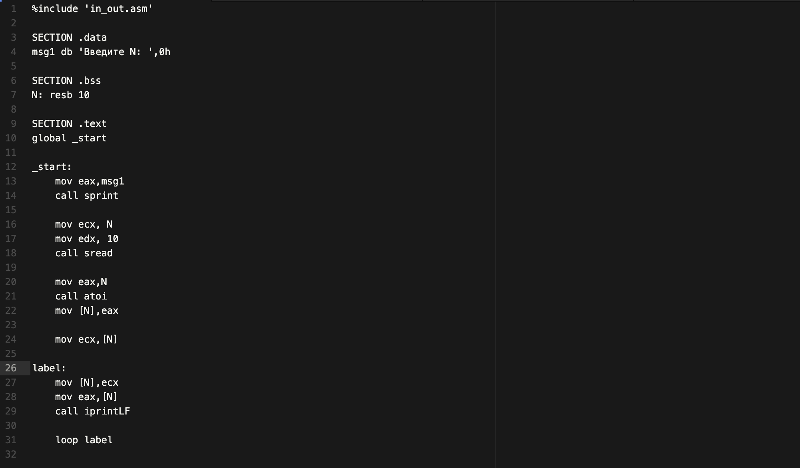
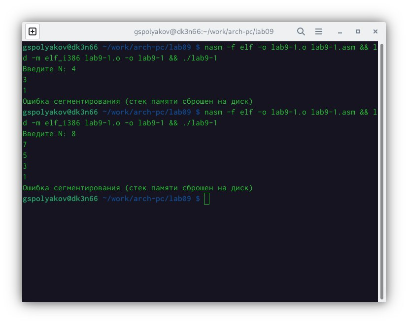
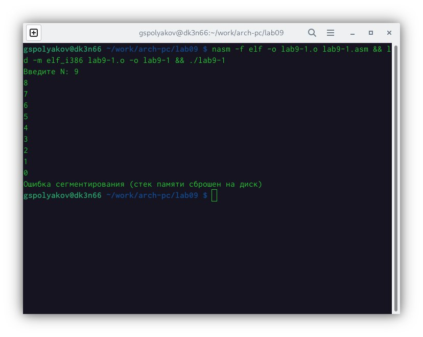
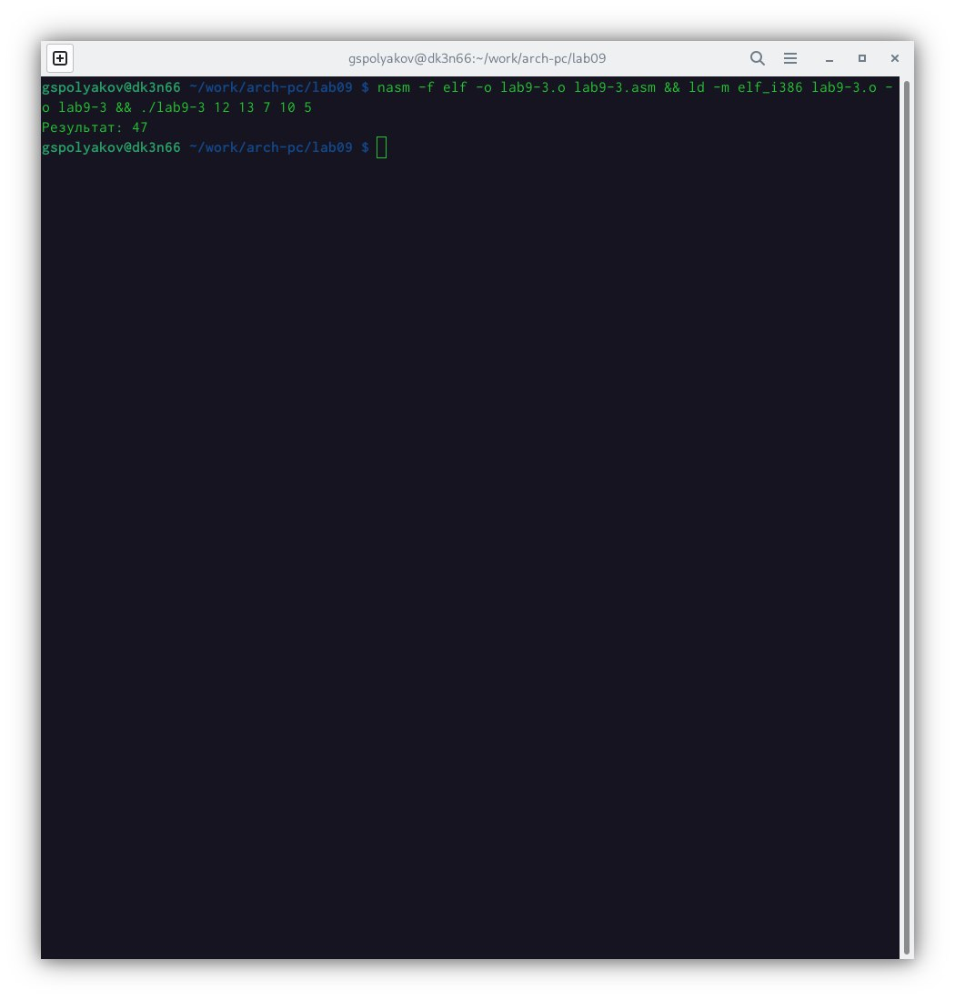
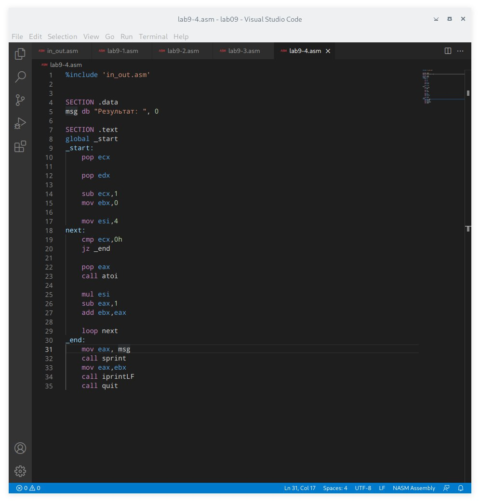

---
## Front matter
title: "Отчёт по лабораторной работе №9"
subtitle: "Программирование цикла. Обработка аргументов командной строки."
author: "Поляков Глеб Сергеевич"

## Generic otions
lang: ru-RU
toc-title: "Содержание"

## Bibliography
bibliography: bib/cite.bib
csl: pandoc/csl/gost-r-7-0-5-2008-numeric.csl

## Pdf output format
toc: true # Table of contents
toc-depth: 2
lof: true # List of figures
lot: true # List of tables
fontsize: 12pt
linestretch: 1.5
papersize: a4
documentclass: scrreprt
## I18n polyglossia
polyglossia-lang:
  name: russian
  options:
	- spelling=modern
	- babelshorthands=true
polyglossia-otherlangs:
  name: english
## I18n babel
babel-lang: russian
babel-otherlangs: english
## Fonts
mainfont: PT Serif
romanfont: PT Serif
sansfont: PT Sans
monofont: PT Mono
mainfontoptions: Ligatures=TeX
romanfontoptions: Ligatures=TeX
sansfontoptions: Ligatures=TeX,Scale=MatchLowercase
monofontoptions: Scale=MatchLowercase,Scale=0.9
## Biblatex
biblatex: true
biblio-style: "gost-numeric"
biblatexoptions:
  - parentracker=true
  - backend=biber
  - hyperref=auto
  - language=auto
  - autolang=other*
  - citestyle=gost-numeric
## Pandoc-crossref LaTeX customization
figureTitle: "Рис."
tableTitle: "Таблица"
listingTitle: "Листинг"
lofTitle: "Список иллюстраций"
lotTitle: "Список таблиц"
lolTitle: "Листинги"
## Misc options
indent: true
header-includes:
  - \usepackage{indentfirst}
  - \usepackage{float} # keep figures where there are in the text
  - \floatplacement{figure}{H} # keep figures where there are in the text
---

# Цель работы

Приобретение навыков написания программ с использованием циклов и обработкой аргументов командной строки.

# Задание

1. Создать каталог и файл lab9-1.asm
2. Написать текст программы lab9-1
3. Создать каталог и файл lab9-2.asm
4. Написать текст программы lab9-2
5. Создать каталог и файл lab9-3.asm
6. Написать текст программы lab9-3
7. Создать каталог и файл lab9-4.asm
8. Написать текст программы lab9-4

# Теоретическое введение

## Организация стека
Стек — это структура данных, организованная по принципу LIFO («Last In — First Out» или «последним пришёл — первым ушёл»). Стек является частью архитектуры процессора и реализован на аппаратном уровне. Для работы со стеком в процессоре есть специальные регистры (ss, bp, sp) и команды. 

Основной функцией стека является функция сохранения адресов возврата и передачи аргументов при вызове процедур. Кроме того, в нём выделяется память для локальных переменных и могут временно храниться значения регистров.

На рис. 9.1 показана схема организации стека в процессоре.

Стек имеет вершину, адрес последнего добавленного элемента, который хранится в регистре esp (указатель стека). Противоположный конец стека называется дном. Значение, помещённое в стек последним, извлекается первым. При помещении значения в стек указатель стека уменьшается, а при извлечении — увеличивается.

Для стека существует две основные операции:

* добавление элемента в вершину стека (push);
* извлечение элемента из вершины стека (pop).

{ #fig:001 width=70% }

### Добавление элемента в стек.
Команда push размещает значение в стеке, т.е. помещает значение в ячейку памяти, на которую указывает регистр esp, после этого значение регистра esp увеличивается на 4. Данная команда имеет один операнд — значение, которое необходимо поместить в стек.
Примеры:

	push -10	; Поместить -10 в стек
	push ebx	; Поместить значение регистра ebx в стек
	push [buf]	; Поместить значение переменной buf в стек
	push word [ax] ; Поместить в стек слово по адресу в ax

Существует ещё две команды для добавления значений в стек. Это команда pusha, которая помещает в стек содержимое всех регистров общего назначения в следующем порядке: ах, сх, dx, bх, sp, bp, si, di. А также команда pushf, которая служит для перемещения в стек содержимого регистра флагов. Обе эти команды не имеют операндов.

### Извлечение элемента из стека.

Команда pop извлекает значение из стека, т.е. извлекает значение из ячейки памяти, на которую указывает регистр esp, после этого уменьшает значение регистра esp на 4. У этой команды также один операнд, который может быть регистром или переменной в памяти.

Нужно помнить, что извлечённый из стека элемент не стирается из памяти и остаётся как “мусор”, который будет перезаписан при записи нового значения в стек.

Примеры:

	pop eax ; Поместить значение из стека в регистр eax
	pop [buf] ; Поместить значение из стека в buf
	pop word[si] ; Поместить значение из стека в слово по адресу в si

Аналогично команде записи в стек существует команда popa, которая восстанавливает из стека все регистры общего назначения, и команда popf для перемещения значений из вершины стека в регистр флагов.
## Инструкции организации циклов
Для организации циклов существуют специальные инструкции. Для всех инструкций максимальное количество проходов задаётся в регистре ecx. Наиболее простой является инструкция loop. Она позволяет организовать безусловный цикл, типичная структура которого имеет следующий вид:

		mov   ecx, 100
	NextStep:
	    ...
	    ...   ; тело цикла
	    ...
	    loop  NextStep   ; Повторить `ecx` раз от метки NextStep
	    
Иструкция loop выполняется в два этапа. Сначала из регистра ecx вычитается единица и его значение сравнивается с нулём. Если регистр не равен нулю, то выполняется переход к указанной метке. Иначе переход не выполняется и управление передаётся команде, которая следует сразу после команды loop.

# Выполнение лабораторной работы

1. Создал каталог и файл lab9-1.asm

2. Ввел текст программы в файл (рис. [-@fig:002])

{ #fig:002 width=70% }

3. Проверил работоспособность программы (рис. [-@fig:003])

.jpeg){ #fig:003 width=70% }

4. Также проверил работу программы с изменениями (рис. [-@fig:004]) и (рис. [-@fig:005]), регистр ecx принимает значения 9-1, число проходов соответствует значению N.

{ #fig:004 width=70% }

{ #fig:005 width=70% }

5. Создал файл lab9-2.asm

6. Ввел текст программы в файл (рис. [-@fig:006])

{ #fig:006 width=70% }

7. Также проверил работу программы с изменениями (рис. [-@fig:008]), программа обработала 3 аргумента.

.jpeg){ #fig:008 width=70% }

8. Создал файл lab9-3.asm

9. Ввел текст программы в файл (рис. [-@fig:009])

{ #fig:009 width=70% }

10. Проверил работоспособность программы (рис. [-@fig:010]).

{ #fig:010 width=70% }

11. Также проверил работу программы с изменениями (рис. [-@fig:011]).

.jpeg){ #fig:011 width=70% }

## Задание для самостоятельной работы

1. Создал файл lab9-4.asm

2. Ввел текст программы в файл (рис. [-@fig:012])

{ #fig:012 width=70% }

3. Проверил работоспособность программы (рис. [-@fig:013])

.jpeg){ #fig:013 width=70% }

# Выводы
Делая лабораторную работу, я приобрел навыки написания программ с использованием циклов и обработкой аргументов командной строки на языке Assembler.

# Список литературы{.unnumbered}

::: {#refs}
:::
