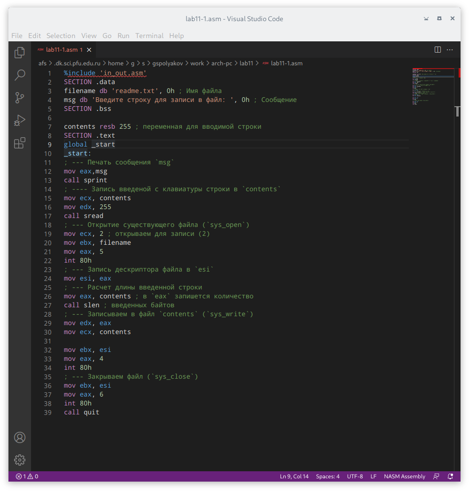
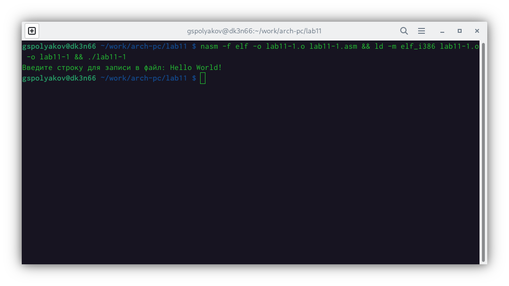
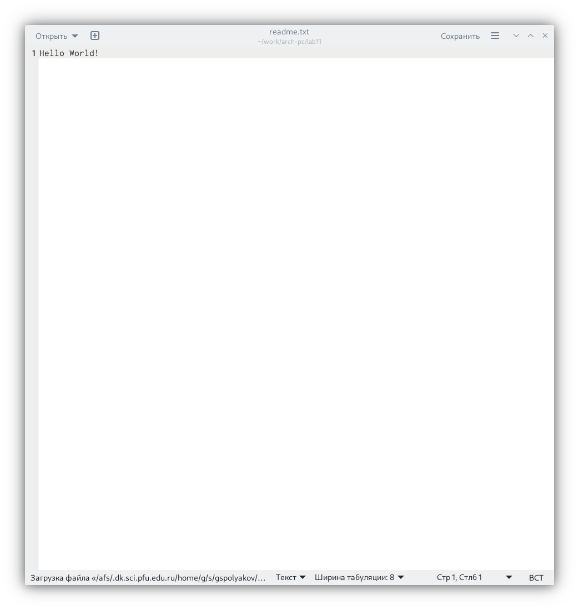
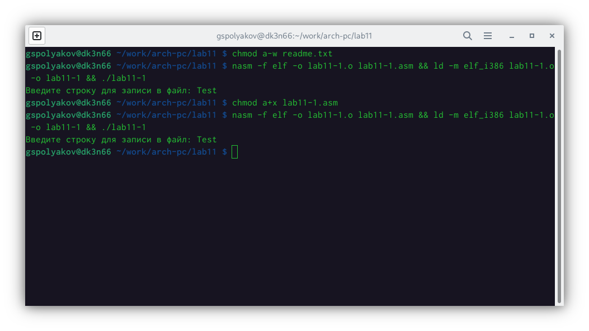
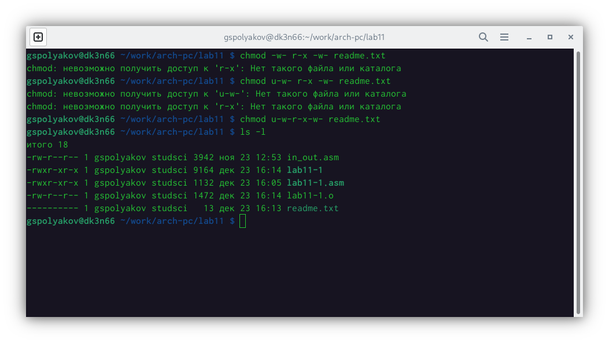
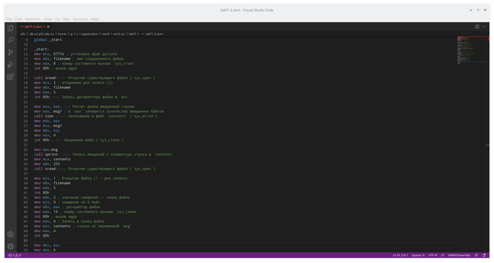
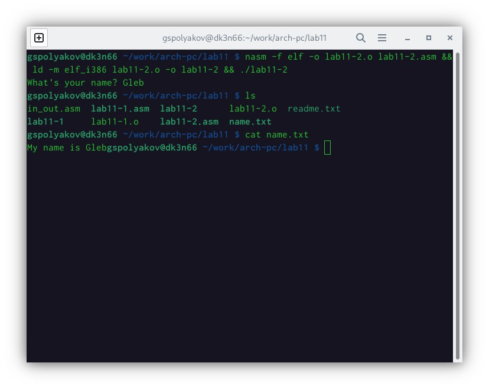

---
## Front matter
title: "Отчёт по лабораторной работе №11"
subtitle: "Работа с файлами средствами Nasm"
author: "Поляков Глеб Сергеевич"

## Generic otions
lang: ru-RU
toc-title: "Содержание"

## Bibliography
bibliography: bib/cite.bib
csl: pandoc/csl/gost-r-7-0-5-2008-numeric.csl

## Pdf output format
toc: true # Table of contents
toc-depth: 2
lof: true # List of figures
lot: true # List of tables
fontsize: 12pt
linestretch: 1.5
papersize: a4
documentclass: scrreprt
## I18n polyglossia
polyglossia-lang:
  name: russian
  options:
	- spelling=modern
	- babelshorthands=true
polyglossia-otherlangs:
  name: english
## I18n babel
babel-lang: russian
babel-otherlangs: english
## Fonts
mainfont: PT Serif
romanfont: PT Serif
sansfont: PT Sans
monofont: PT Mono
mainfontoptions: Ligatures=TeX
romanfontoptions: Ligatures=TeX
sansfontoptions: Ligatures=TeX,Scale=MatchLowercase
monofontoptions: Scale=MatchLowercase,Scale=0.9
## Biblatex
biblatex: true
biblio-style: "gost-numeric"
biblatexoptions:
  - parentracker=true
  - backend=biber
  - hyperref=auto
  - language=auto
  - autolang=other*
  - citestyle=gost-numeric
## Pandoc-crossref LaTeX customization
figureTitle: "Рис."
tableTitle: "Таблица"
listingTitle: "Листинг"
lofTitle: "Список иллюстраций"
lotTitle: "Список таблиц"
lolTitle: "Листинги"
## Misc options
indent: true
header-includes:
  - \usepackage{indentfirst}
  - \usepackage{float} # keep figures where there are in the text
  - \floatplacement{figure}{H} # keep figures where there are in the text
---

# Цель работы

Приобретение навыков написания программ для работы с файлами.

# Задание
1. Создать каталог для программам лабораторной работы No 11
2. Ввести в файл lab11-1.asm текст программы из листинга 11.1(Программа записи в файл сообщения). Создайть исполняемый файл и проверить его работу.
3. С помощью команды chmod измените права доступа к исполняемому файлу lab11-1, запретив его выполнение. Попытайтесь выполнить файл. Объясните результат.
4. С помощью команды chmod измените права доступа к файлу lab11-1.asm с исходным текстом программы, добавив права на исполнение. Попытайтесь выполнить его и объясните результат.
5.  Предоставить права доступа к файлу readme.txt в соответствии с вариантом в таблице 11.4. Проверить правильность выполнения с помощью команды ls -l.

## Задание для самостоятельной работы

Напишите программу работающую по следующему алгоритму:

* Вывод приглашения “Как Вас зовут?”
* ввести с клавиатуры свои фамилию и имя • создать файл с именем name.txt
* записать в файл сообщение “Меня зовут”
* дописать в файл строку введенную с клавиатуры 
* закрыть файл

Создайте исполняемый файл и проверьте его работу. Проверьте наличие файла и его содержимое с помощью команд ls и cat.

# Теоретическое введение

## Права доступа к файлам

ОС GNU/Linux является многопользовательской операционной системой. И для обеспечения защиты данных одного пользователя от действий других поль- зователей существуют специальные механизмы разграничения доступа к фай- лам. Кроме ограничения доступа, данный механизм позволяет разрешить дру- гим пользователям доступ данным для совместной работы.
Права доступа определяют набор действий (чтение, запись, выполнение), разрешённых для выполнения пользователям системы над файлами. Для каждого файла пользователь может входить в одну из трех групп: владелец, член группы владельца, все остальные. Для каждой из этих групп может быть установлен свой набор прав доступа. Владельцем файла является его создатель. Для предоставления прав доступа другому пользователю или другой группе командой

	chown [ключи] <новый_пользователь>[:новая_группа] <файл> или
	chgrp [ключи] < новая_группа > <файл>

Набор прав доступа задается тройками битов и состоит из прав на чтение, запись и исполнение файла. В символьном представлении он имеет вид строк rwx, где вместо любого символа может стоять дефис. Всего возможно 8 комбинаций, приведенных в таблице 11.1. Буква означает наличие права (установлен в единицу второй бит триады r — чтение, первый бит w — запись, нулевой бит х — исполнение), а дефис означает отсутствие права (нулевое значение соответствующего бита). Также права доступа могут быть представлены как восьмеричное число. Так, права доступа rw(чтение и запись, без исполнения) понимаются как три двоичные цифры 110 или как восьмеричная цифра 6.

Таблица 11.1. Двоичный, буквенный и восмеричный способ записи триады прав доступа

| Двоичный | Буквенный | Восмеричный |
|-----|-----|---|
| 111 | rwx | 7 |
| 110 | rw- | 6 |
| 101 | r-x | 5 |
| 100 | r-- | 4 |
| 011 | -wx | 3 |
| 010 | -w- | 2 |
| 001 | --x | 1 |
| 000 | --- | 0 |

Полная строка прав доступа в символьном представлении имеет вид:

	<права_владельца> <права_группы> <права_остальных>

Так, например, права rwx r-x --x выглядят как двоичное число 111 101 001, или восьмеричное 751.
Свойства (атрибуты) файлов и каталогов можно вывести на терминал с помощью команды ls с ключом -l. Так например, чтобы узнать права доступа к файлу README можно узнать с помощью следующей команды:
	
	$ls -l /home/debugger/README  -rwxr-xr-- 1 debugger users 0 Feb 14 19:08 /home/debugger/README

В первой колонке показаны текущие права доступа, далее указан владелец файла и группа:
Тип файла определяется первой позицией, это может быть: каталог — d, обычный файл — дефис (-) или символьная ссылка на другой файл — l. Следующие 3 набора по 3 символа определяют конкретные права для конкретных групп: r — разрешено чтение файла, w — разрешена запись в файл; x — разрешено исполнение файл и дефис (-) — право не дано.
Для изменения прав доступа служит команда chmod, которая понимает как символьное, так и числовое указание прав. Для того чтобы назначить файлу /home/debugger/README права rw-r, то есть разрешить владельцу чтение и запись, группе только чтение, остальным пользователям — ничего:
	
	chmod 640 README # 110 100 000 == 640 == rw-r-----
	ls -l README
	-rw-r 1 debugger users 0 Feb 14 19:08 /home/debugger/README

В символьном представлении есть возможность явно указывать какой группе какие права необходимо добавить, отнять или присвоить. Например, чтобы добавить право на исполнение файла README группе и всем остальным:

	chmod go+x README
	ls -l README
	-rw-r-x--x 1 debugger users 0 Feb 14 19:08 /home/debugger/README

Формат символьного режима:
	
	chmod <категория><действие><набор_прав><файл>

Возможные значения аргументов команды представлены в таблице 11.2.

Возможные значения аргументов команды chmod

| Категория | Обозначение | Значение |
|----------------|---|----------|
| Принадлежность | u | Владелец |
| | g | Группа владельца |
| | o | Прочие пользователи |
| | a | Все пользователи, то есть «а» эквивалентно «ugo» |
| Действие | + | Добавить набор прав |
| | - | Отменить набор прав |
| | = | Назначить набор прав |
| Право | r | Право на чтение |
| | w | Право на запись |
| | x | Право на исполнение |

##Работа с файлами средствами Nasm

В операционной системе Linux существуют различные методы управления файлами, например, такие как создание и открытие файла, только для чтения или для чтения и записи, добавления в существующий файл, закрытия и удаления файла, предоставление прав доступа.
Обработка файлов в операционной системе Linux осуществляется за счет использования определенных системных вызовов. Для корректной работы и доступа к файлу при его открытии или создании, файлу присваивается уникальный номер (16-битное целое число) – дескриптор файла.
В таблице 11.3 приведены системные вызовы для обработки файлов.

Таблица 11.3. Cистемные вызовы для обработки файлов

| Имя системного вызова | eax | ebx | ecx | edx |
|----------|---|-------|---|---|------------------|
| sys_read | 3 | дескриптор файла | адрес в памяти | количество байтов |
| sys_write| 4 | дескриптор файла | строка| количество байтов |
| sys_open | 5 | имя файла | режим доступа к файлу| права доступа к файлу |
| sys_close | 6 | дескриптор файла | — | – |
| sys_creat | 8 | имя файла | права доступа к файлу | – |
| sys_unlink | 10 | имя файла | – | – |
| sys_lseek | 19 | имя файла | значение смещения в байтах | позиция для смещения|

Общий алгоритм работы с системными вызовами в Nasm можно представить в следующем виде:

1. Поместить номер системного вызова в регистр EAX;
2. Поместить аргументы системного вызова в регистрах EBX, ECX и EDX; 
3. Вызов прерывания (int 80h);
4. Результат обычно возвращается в регистр EAX.

###Открытие и создание файла

Для создания и открытия файла служит системный вызов sys_creat, который использует следующие аргументы: права доступа к файлу в регистре ECX, имя файла в EBX и номер системного вызова sys_creat (8) в EAX.
   
	mov  ecx, 0777o     ; установка прав доступа
	mov  ebx, filename  ; имя создаваемого файла
	mov  eax, 8         ; номер системного вызова `sys_creat`
	int  80h            ; вызов ядра

Для открытия существующего файла служит системный вызов sys_open, который использует следующие аргументы: права доступа к файлу в регистре EDX, режим доступа к файлу в регистр ECX, имя файла в EBX и номер системного вызова sys_open (5) в EAX.
Среди режимов доступа к файлам чаще всего используются:

* (0) – O_RDONLY (открыть файл в режиме только для чтения);
* (1) – O_WRONLY – (открыть файл в режиме только записи);
* (2) – O_RDWR – (открыть файл в режиме чтения и записи).

С другими режимами доступа можно ознакомиться в https://man7.org/.

Системный вызов возвращает файловый дескриптор открытого файла в регистр EAX. В случае ошибки, код ошибки также будет находиться в регистре EAX.

	mov  ecx, 0        ; режим доступа (0 только чтение)
	mov  ebx, filename ; имя открываемого файла
	mov  eax, 5        ; номер системного вызова `sys_open`
	int  80h           ; вызов ядра

###Запись в файл

Для записи в файл служит системный вызов sys_write, который использует следующие аргументы: количество байтов для записи в регистре EDX, строку содержимого для записи ECX, файловый дескриптор в EBX и номер системного вызова sys_write (4) в EAX.
Системный вызов возвращает фактическое количество записанных байтов в регистр EAX. В случае ошибки, код ошибки также будет находиться в регистре EAX.
Прежде чем записывать в файл, его необходимо создать или открыть, что позволит получить дескриптор файла.
	
	mov  ecx, 0777o     ; Создание файла.
	mov  ebx, filename  ; в случае успешного создания файла,
	mov  eax, 8       ; в регистр eax запишется дескриптор файла
	int  80h
	mov  edx, 12
	mov  ecx, msg
	mov  ebx, eax
	mov  eax, 4
	int  80h

###Чтение файла
; количество байтов для записи
; адрес строки для записи в файл
; дескриптор файла
; номер системного вызова `sys_write`
; вызов ядра
Для чтения данных из файла служит системный вызов sys_read, который использует следующие аргументы: количество байтов для чтения в регистре EDX, адрес в памяти для записи прочитанных данных в ECX, файловый дескриптор в EBX и номер системного вызова sys_read (3) в EAX. Как и для записи, прежде чем читать из файла, его необходимо открыть, что позволит получить дескриптор файла.
   mov  ecx, 0         ; Открытие файла.
   mov  ebx, filename  ; в случае успешного открытия файла,
   mov  eax, 5       ; в регистр EAX запишется дескриптор файла
   int  80h
   mov  edx, 12        ; количество байтов для чтения
   mov  ecx, fileCont  ; адрес в памяти для записи прочитанных данных mov ebx, eax mov eax, 3 int 80h

###Закрытие файла
Для правильного закрытия файла служит системный вызов sys_close, который использует один аргумент – дескриптор файла в регистре EBX. После вызова ядра происходит удаление дескриптора файла, а в случае ошибки, системный вызов возвращает код ошибки в регистр EAX.

	mov  ecx, 0         ; Открытие файла.
	mov  ebx, filename  ; в случае успешного открытия файла,
	mov  eax, 5; в регистр EAX запишется дескриптор файла
	int  80h
	mov  ebx, eax; дескриптор файла
	mov  eax, 6; номер системного вызова `sys_close`
	int  80h; вызов ядра
	
###Изменение содержимого файла
Для изменения содержимого файла служит системный вызов sys_lseek, который использует следующие аргументы: исходная позиция для смещения EDX, значение смещения в байтах в ECX, файловый дескриптор в EBX и номер системного вызова sys_lseek (19) в EAX.
Значение смещения можно задавать в байтах. Значения обозначающие исходную позиции могут быть следующими:

* (0) – SEEK_SET (начало файла);
* (1) – SEEK_CUR (текущая позиция);
* (2) – SEEK_END (конец файла).

В случае ошибки, системный вызов возвращает код ошибки в регистр EAX.

	mov  ecx, 1; Открытие файла (1 - для записи).
	mov  ebx, filename
	mov  eax, 5
	int  80h
	mov  edx, 2; значение смещения -- конец файла
	mov  ecx, 0; смещение на 0 байт

Удаление файла осуществляется системным вызовом sys_unlink, который использует один аргумент – имя файла в регистре EBX.
	
	mov  ebx, filename  ; имя файла
	mov  eax, 10        ; номер системного вызова `sys_unlink`
	int  80h            ; вызов ядра
В качестве примера приведем программу, которая открывает существующий файл, записывает в него сообщение и закрывает файл.

###Листинг 11.1. Программа записи в файл сообщения.
;--------------------------------
; Запись в файл строки введененой на запрос
;--------------------------------

	%include    'in_out.asm'
	SECTION .data
	filename db 'readme.txt', 0h; Имя файла
	msg db 'Введите строку для записи в файл: ', 0h; Сообщение
	SECTION .bss
	mov  ebx, eax
	mov  eax, 19
	int  80h
	mov  edx, 9
	mov  ecx, msg
	mov  eax, 4
	int  80h

	contents resb 255
	SECTION .text global _start
	_start:
	mov eax,msg
	call sprint
	mov  ecx, contents
	mov  edx, 255
	call sread
	mov  ecx, 2
	mov  ebx, filename
	mov  eax, 5
	int  80h
	mov esi, eax
	mov  eax, contents
	call slen
	mov  edx, eax
	mov  ecx, contents

	mov  ebx, esi
	mov  eax, 4
	int  80h
	mov  ebx, esi
	mov  eax, 6
	int  80h
	call quit
	
Результат работы программы:

	user@dk4n31:~ nasm -f elf -g -l main.lst main.asm
	user@dk4n31:~ ld -m elf_i386 -o main main.o
	user@dk4n31:~ ./main
	Введите строку для записи в файл: Hello world!
	user@dk4n31:~**** ls -l
	-rwxrwxrwx 1 user user    20 Jul  2 13:06 readme.txt
	-rwxrwxrwx 1 user user 11152 Jul  2 13:05 main
	-rwxrwxrwx 1 user user  1785 Jul  2 13:03 main.asm
	-rwxrwxrwx 1 user user 22656 Jul  2 13:05 main.lst
	-rwxrwxrwx 1 user user  4592 Jul  2 13:05 main.o
	user@dk4n31:~ cat readme.txt
	Hello world!
	user@dk4n31:~$

# Выполнение лабораторной работы

1. Создал каталог для программ лабораторной работы No11, перейдите в него и создайте файл lab11-1.asm и readme.txt
2. Ввел в файл lab11-1.asm текст программы из листинга 11.1(Программа записи в файл сообщения). Создал исполняемый файл и проверил его работу. (рис. [-@fig:001]) (рис. [-@fig:002])(рис. [-@fig:003])
{ #fig:001 width=70% }
{ #fig:002 width=70% }
{ #fig:003 width=70% }

3. С помощью команды chmod измените права доступа к исполняемому файлу lab11-1, запретив его выполнение. Попытайтесь выполнить файл. Объясните результат.
(К сожалению, скриншоты потерял) (программа не исполняется, поскольку отсутствие права накладывается на скомпилированый файл)

4. С помощью команды chmod измените права доступа к файлу lab11-1.asm с исходным текстом программы, добавив права на исполнение. Попытайтесь выполнить его и объясните результат. (программа работает, посколькольку ограничение наложено на текстовый файл, а не на исплоняемый)
{ #fig:004 width=70% }

5. Предоставить права доступа к файлу readme.txt в соответствии с вариантом в таблице 11.4. Проверить правильность выполнения с помощью команды ls -l.
{ #fig:005 width=70% }

## Выполнение самостоятельной работы

1. Напишите программу работающую по алгоритму
{ #fig:006 width=70% }

2. Создать исполняемый файл и проверить его работу. Проверить наличие файла и его содержимое с помощью команд ls и cat.
{ #fig:007 width=70% }
(рис. [-@fig:001])

# Выводы

Выполняя лабораторную работу, приобрел навыки написания программ для работы с файлами.

# Список литературы{.unnumbered}

::: {#refs}
:::
